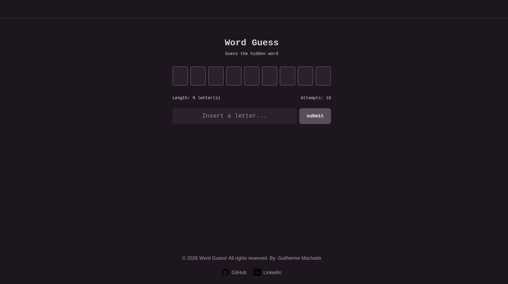

# 🎮 Word Guess! (Word Quest)

> An interactive, modern, and lightweight word-guessing game built with React and Tailwind CSS.

## Overview

**Word Guess!** is a classic hidden-word puzzle game reinvented with modern web technologies. Players are challenged to decipher a secret word by guessing it letter by letter. Every correct guess reveals the letter's position, while incorrect guesses inch the player closer to game over.

Originally conceptualized as a console application, this project was entirely rewritten for the web, focusing on a fluid user experience, responsive design, and clean state management.

### Live Demo
Play the game live here: [**Insert your Vercel Link Here**](https://your-project-name.vercel.app)

## Key Features

- **Sleek UI/UX:** Dark mode interface crafted with Tailwind CSS for a modern, eye-friendly experience.
- **Smart Validation:** Input sanitization that automatically rejects numbers and special characters.
- **Dynamic Gameplay:** Real-time feedback with color-coded states (🟢 Success, 🔴 Danger) for attempts and results.
- **Curated Word Library:** Includes a custom dictionary of 100+ unaccented words for fair and seamless gameplay.
- **Fully Responsive:** Playable on both desktop and mobile devices.

## Tech Stack

- **Frontend:** [React](https://reactjs.org/) (Hooks, State Management)
- **Styling:** [Tailwind CSS](https://tailwindcss.com/)
- **Build Tool:** [Vite](https://vitejs.dev/)
- **Deployment:** [Vercel](https://vercel.com/)

## How to Play

1. The game starts with a hidden word represented by blank slots (`-`).
2. Type a letter in the input field and hit **Enter** (or click the submit button).
3. If the letter exists in the word, it will be revealed in its correct position(s).
4. If the letter is wrong, you lose 1 of your 10 total attempts.
5. **Win** by revealing the entire word before running out of attempts, or **Lose** if your attempts hit zero.

## Getting Started (Local Setup)

Want to run this project locally? Follow these simple steps:

### Prerequisites
- [Node.js](https://nodejs.org/) installed on your machine.

### Installation

**Clone the repository:**
bash
git clone [https://github.com/devbianchi/word-guess-game.git](https://github.com/devbianchi/word-guess-game.git)

**Navigate to the project directory:**
bash
cd word-guess

**Install dependencies:**
Bash
npm install

**Start the development server:**
Bash
npm run dev

**Open http://localhost:5173 in your browser to see the app running.**

### Roadmap (Future Improvements)

This project is a great foundation for further development. Planned features include:

    [ ] Add word categories (e.g., Animals, Tech, Countries) and display hints.

    [ ] Implement visual animations (e.g., shaking the input box on a wrong guess).

    [ ] Track high scores and win streaks using localStorage.

    [ ] Add sound effects for correct/incorrect guesses.

    [ ] Create an on-screen visual keyboard for better mobile accessibility.

### Contributing

Contributions, issues, and feature requests are welcome! Feel free to check the issues page.

Built with ❤️ for frontend development.
